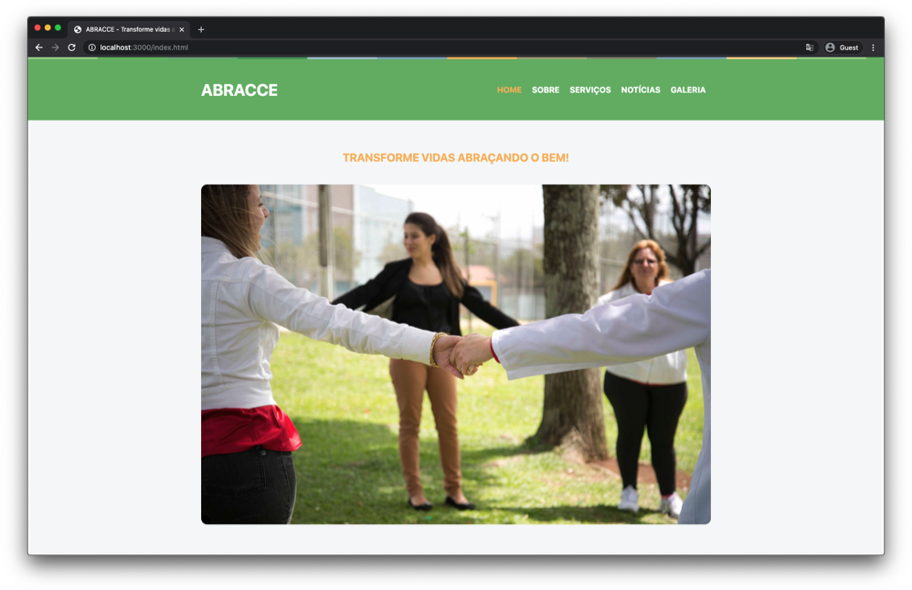

# [Camilla desafio](https://camilla-desafio.netlify.app/)

> Um pequeno desafio front-end para Camilla

## Descrição do desafio

> Fazer um topo parecido (um pouco mais simples) com o topo do site da [Abracce](https://www.abracce.org.br/)

## Itens para cumprir o desafio

- Largura do container do site: 1000px
- Link da imagem da linha do topo: https://www.abracce.org.br/wp-content/themes/abracce/assets/images/line.jpg
- Cor de fundo do topo: #6bb566
- Cor do link ativo do menu: #f8b759
- Cor do texto da chamada: #f8b759
- Link da imagem da página inicial: https://www.abracce.org.br/wp-content/uploads/2014/09/110.jpg

## Dicas

- Sempre use classes;
- Use CSS Flexbox;

### DIVIRTA-SE!